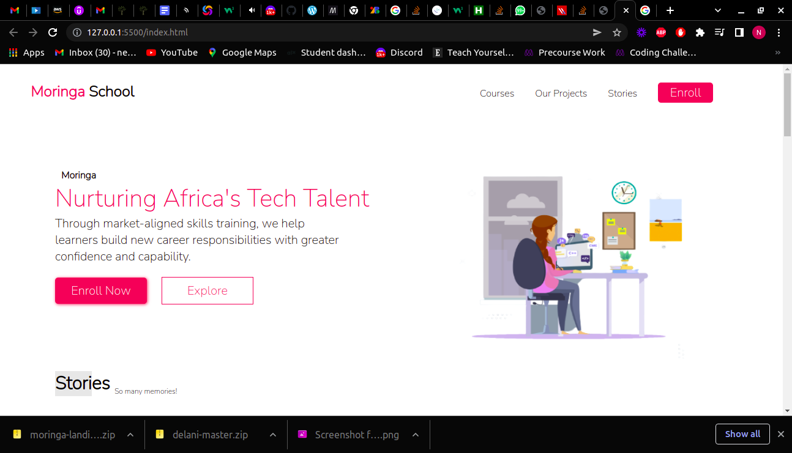

# MORINGA SCHOOL LANDING PAGE

   ## By Newton Ombese

## Screenshot
   

## Table of Content

- [Description](#description)
- [Features](#features)
- [Requirements](#requirements)
- [Installation Process](#installation-Process)
- [Live link](#Live-Link)
- [Technology Used](#technology-Used)
- [Licence](#licence)
- [Authors Info](#Authors-info)

## Description

 
This project is a web application for Moringa School that shows details about the services it offers, has information about the school, an enroll that enables users to start and application to join the school.

## Features

As a user of the application,you will be able to :

1. See a description of technical mentors at the school
1. Can make an application through enroll button

 ###  Requirements

 * Access to  a computer or any other garget

 * Access to internet

### Installation Process

 ****  
* Clone to the repo : git clone https://github.com/NewtonOmbese/Moringa-School_Landing_Page.git

* Unzip the downloaded files in a folder of choice.

* Open the index file from the zipped file with any browser.

## Live Link
- Click this link to view the live application https://newtonombese.github.io/Moringa-School_Landing_Page/

### Technology  Used
* HTML - which was used to develope the structure off the pages.

* CSS - which was used to style the User Interface.

MIT License

Copyright (c) [2022] [Newton Ombese]

Permission is hereby granted, free of charge, to any person obtaining a copy
of this software and associated documentation files (the "Software"), to deal
in the Software without restriction, including without limitation the rights
to use, copy, modify, merge, publish, distribute, sublicense, and/or sell
copies of the Software, and to permit persons to whom the Software is
furnished to do so, subject to the following conditions:

The above copyright notice and this permission notice shall be included in all
copies or substantial portions of the Software.

THE SOFTWARE IS PROVIDED "AS IS", WITHOUT WARRANTY OF ANY KIND, EXPRESS OR
IMPLIED, INCLUDING BUT NOT LIMITED TO THE WARRANTIES OF MERCHANTABILITY,
FITNESS FOR A PARTICULAR PURPOSE AND NONINFRINGEMENT. IN NO EVENT SHALL THE
AUTHORS OR COPYRIGHT HOLDERS BE LIABLE FOR ANY CLAIM, DAMAGES OR OTHER
LIABILITY, WHETHER IN AN ACTION OF CONTRACT, TORT OR OTHERWISE, ARISING FROM,
OUT OF OR IN CONNECTION WITH THE SOFTWARE OR THE USE OR OTHER DEALINGS IN THE
SOFTWARE.

## Authors Info

LinkedIn - [Newton Ombese](https://www.linkedin.com/in/newton-ombese-570862210/)